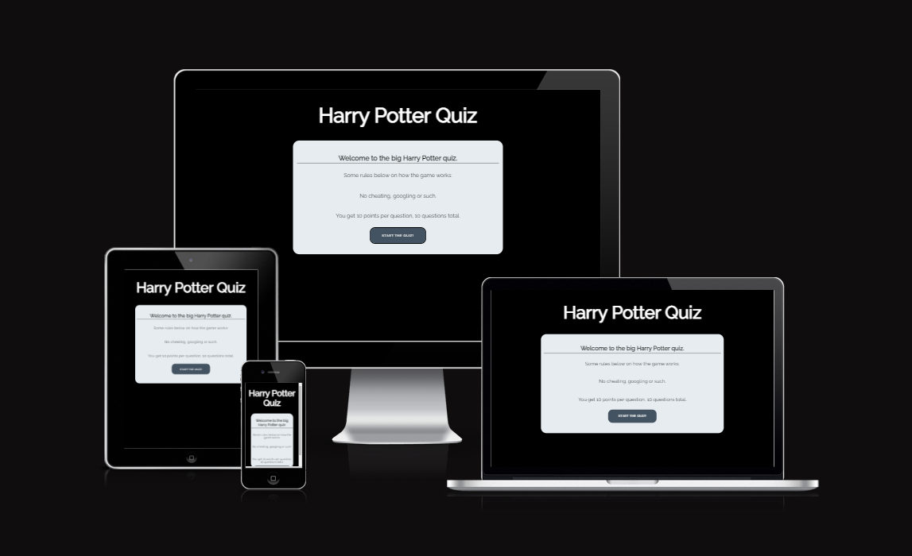
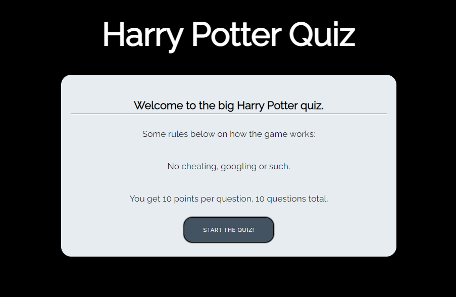
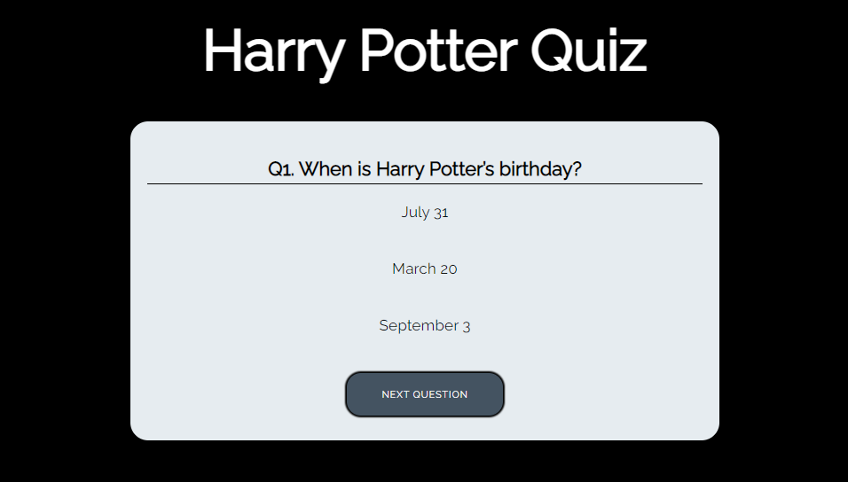
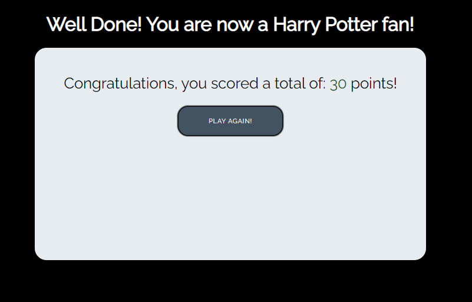

# Harry Potter Quiz

Harry Potter quiz is a game to test your knowledge about the world of Hogwarts. Test your skills and challenge your friends, 
to see who scores the highest points.

The quiz has 10 questions, ranged from easy - expert kind of questions. Can you get a score of 100 on this quiz?
Be sure to brag, if you do.

## Features

### Existing Features

 * Landing Page
   * At the top of the page, is a header, acting as a link for you to click whenever you want to start over.
   * This header clearly tells you what game you are playing.
   * The rules tells you that cheating / googling the answers is not okay, since this is a challenge to yourself.
   * The rules tells you how many questions the quiz has, and how many points you get per question.

* Questions
  * This section tells you what question you are beeing asked to answer.
  * This section provides you with 3 answers, 1 is the right answer.

* Score
  * This section congratulates you for completing the quiz, and tells you how many points you got.

### Features Left to Implement
 * When there is time, i would like to implement a scoreboard.

## Testing
 * I tested playing this game in different browsers: Chrome, Firefox, Safari.
 * I confirmed that the game results are always correct.
 * I confirmed that the header, instructions, options, results and footer text are all readable and easy to understand.
 * I confirmed that the colors and fonts chosen are easy to read and accessible by running it through lighthouse in devtools.

 

 
 
 

### Validator Testing
 * Html
   * No errors were returned when passing through the official W3C validator.
 * CSS
   * No errors were found when passing through the official (Jigsaw) validator.
 * JavaScript
   * No errors were found when passing through the official JSHint JavaScript validator.

### Unfixed Bugs
No unfixed bugs

## Deployment
 * The site was deployed to GitHub pages.

The link can be found here -(Harry Potter Quiz)[]

## Credits
### Content
 * Parts of the code to fix quiz game JavaScript was taken from [Praroz youtube](https://www.youtube.com/watch?v=1ydfKDwsYbU) and the [Love Math project](https://github.com/Undie92/love-maths)
 * The favicon was taken from [Icons 8](https://icons8.com/icons/set/favicon)
 * The questions for the quiz was taken from [BigQuizThing](https://bigquizthing.com/trivia-questions-ans/harry-potter-trivia-questions-and-answers/)