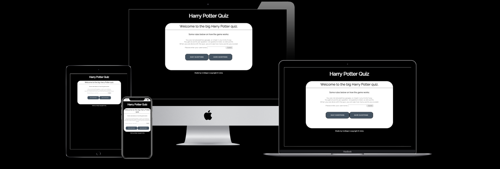
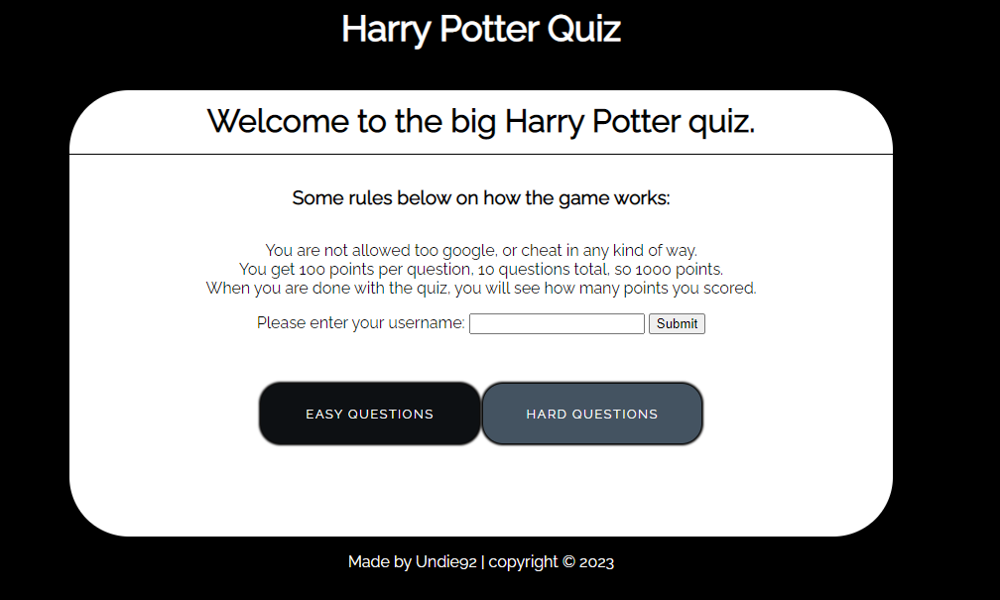
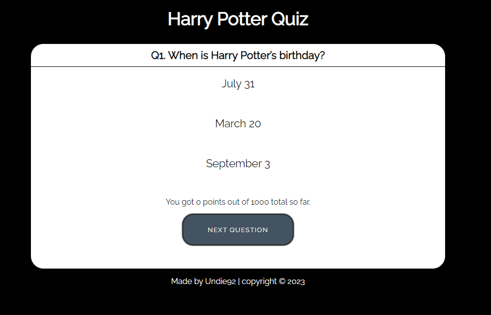
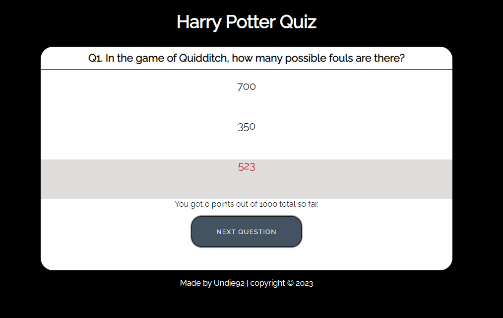
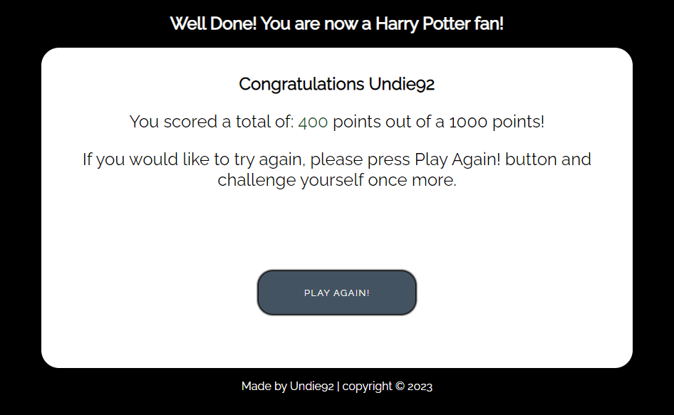
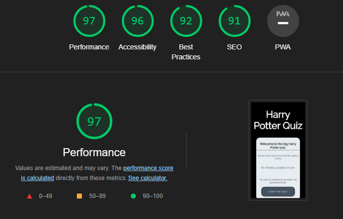
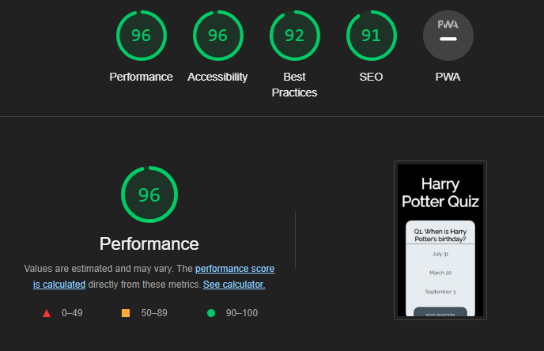
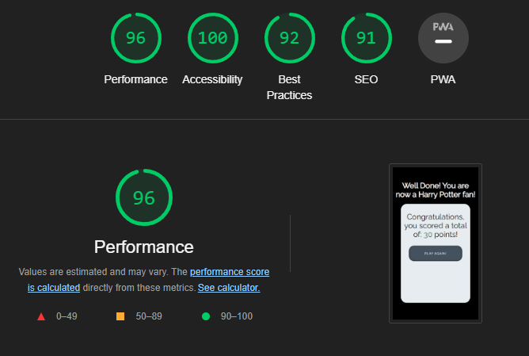

# Harry Potter Quiz

Harry Potter quiz is a game to test your knowledge about the world of Hogwarts. Test your skills and challenge your friends, 
to see who scores the highest points.

The quiz has 2 difficulty levels with 10 questions each level, the difficulty levels that can be played is, easy & hard. Can you get a score of 1000 on both levels?
Be sure to brag, if you do.

## Features

### Existing Features

 * Landing Page
   * At the top of the page, is a header, acting as a link for you to click whenever you want to start over.
   * This header clearly tells you what game you are playing.
   * The rules tells you that cheating / googling the answers is not okay, since this is a challenge to yourself.
   * The rules tells you how many questions the quiz has, and how many points you get per question.
   * The rules tells you that when you are done with the quiz, you will see the total score you achieved.
   * The landing page also allows the user to enter a username, to make the game more personal.
   * At the bottom of the page, is a footer, telling you that the page is copyrighted and is made by the site developer.

* Easy questions
  * Contains questions ranging 1-10.
  * This section tells you what question you are beeing asked to answer.
  * This section provides you with 3 answers, 1 is the right answer.
  * Shows your current score out of 1000 total points.

* Hard questions
  * Contains questions ranging 1-10.
  * This section tells you what question you are beeing asked to answer.
  * This section provides you with 3 answers, 1 is the right answer.
  * Shows your current score out of 1000 total points.

* Score
  * This section shows your username if you entered a username at the start.
  * This section shows your total score out of a 1000 points.
  * This section congratulates you for completing the quiz, asking you if you would like to try again.

### Features Left to Implement
 * When there is time, i would like to implement a scoreboard.

## Testing
 * I tested playing this game in different browsers: Chrome, Firefox, Safari.
 * I confirmed that the game results are always correct.
 * I confirmed that the header, instructions, options, results and footer text are all readable and easy to understand.
 * I confirmed that the colors and fonts chosen are easy to read and accessible by running it through lighthouse in devtools.

 

 
 
 

### Validator Testing
 * Html
   * No errors were returned when passing through the official W3C validator.
 * CSS
   * No errors were found when passing through the official (Jigsaw) validator.
 * JavaScript
   * No errors were found when passing through the official JSHint JavaScript validator.

### Unfixed Bugs
No unfixed bugs

## Deployment
 - The site was deployed to GitHub pages. The steps to deploy are as follows: 
  - In the GitHub repository, navigate to the Settings tab 
  - From the source section drop-down menu, select the Main Branch
  - Once the main branch has been selected, the page will be automatically refreshed with a detailed ribbon display to indicate the successful deployment. 

The link can be found here - [Harry Potter Quiz](https://undie92.github.io/harry-quiz/)

### Forking the GitHub Repository

Steps to Fork the GitHub Repository

Forking allows you to view and edit the code without affecting the original repository

1. Locate the GitHub repository. Link to this repository can be found [here](https://github.com/MoniPar/tailors_thimble).
2. Click on 'Fork', in the top right-hand corner.
3. This will take you to your own repository to a fork with the same name as the original branch.

___

### Creating a Local Clone

Steps to Creating a Local Clone

1. Go to the GitHub repository. Link to this repository can be found [here](https://github.com/MoniPar/tailors_thimble).
2. Click on 'Code' to the right of the screen. This will open a dropdown. Click on HTTPs and copy the link.
3. Open Git Bash in your IDE and change the current working directory to the location where you want the cloned directory.
4. Type `git clone`, paste the URL you copied earlier, and press Enter to create your local clone.

More information on Creating and Managing repositories can be found [here](https://docs.github.com/en/repositories/creating-and-managing-repositories/cloning-a-repository)
 

## Credits
### Content
 * Parts of the code to fix quiz game JavaScript was taken from [Praroz youtube](https://www.youtube.com/watch?v=1ydfKDwsYbU) and the [Love Math project](https://github.com/Undie92/love-maths)
 * The favicon was taken from [Icons 8](https://icons8.com/icons/set/favicon)
 * The questions for the easy quiz was taken from [BigQuizThing](https://bigquizthing.com/trivia-questions-ans/harry-potter-trivia-questions-and-answers/)
 * The questions for the hard quiz was taken from [Nottinghampost](https://www.nottinghampost.com/whats-on/whats-on-news/50-harry-potter-quiz-questions-4153972)